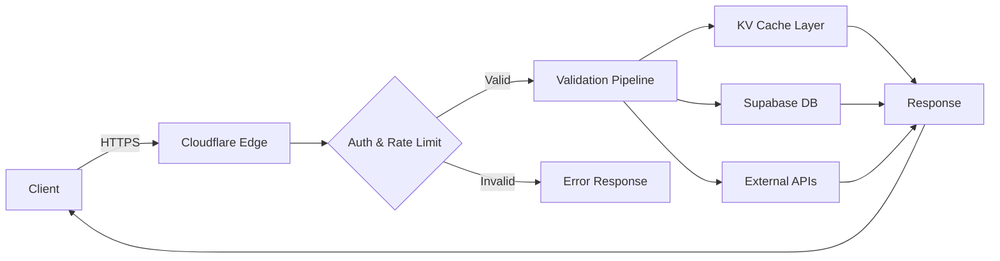

## Validation Flow

When you send an email to Vouch for validation, it goes through a sophisticated multi-stage pipeline designed for both speed and accuracy.

<Steps>
  <Step title="Authentication & Authorization">
    Vouch validates your API key, checks project permissions, and verifies rate limits and quotas
  </Step>

  <Step title="Smart Parallel Validation">
    All 9 validation checks start simultaneously with intelligent early-exit optimization
  </Step>

  <Step title="Risk Aggregation">
    Individual signals are combined into a final recommendation based on your project configuration
  </Step>

  <Step title="Logging & Analytics">
    Results are logged (with encrypted emails) for analytics and usage tracking
  </Step>
</Steps>

## Smart Early-Exit Strategy

Vouch uses an intelligent validation strategy that minimizes latency while maximizing data quality:

### BLOCK Checks (Promise.race)

These checks can immediately reject an email if they fail:

- **Syntax validation**
- **Disposable email detection**
- **MX records verification**

```typescript
// Pseudo-code illustration
const blockChecks = Promise.race([
  checkSyntax(),
  checkDisposable(),
  checkMX()
]);

// Returns immediately on first failure
// Or waits for all to succeed
```

<Info>
  If any BLOCK check fails, Vouch can return immediately without waiting for other checks to complete.
</Info>

### FLAG Checks (Promise.all)

These checks run to completion to gather maximum intelligence:

- **SMTP verification**
- **Catch-all detection**
- **Role email detection**
- **Alias detection**
- **Device fingerprinting**
- **IP reputation**

```typescript
// Pseudo-code illustration
const flagChecks = await Promise.all([
  checkSMTP(),
  checkCatchall(),
  checkRoleEmail(),
  checkAlias(),
  checkDeviceFingerprint(),
  checkIPReputation()
]);

// Waits for all checks to complete
```

<Tip>
  This approach typically returns results in **200-500ms** while still gathering comprehensive fraud signals.
</Tip>

## The 9 Validation Types

<AccordionGroup>
  <Accordion title="1. Syntax Validation" icon="code" defaultOpen>
    **Action:** BLOCK

    Validates email format against RFC 5322 standards:
    - Local part validation (before @)
    - Domain part validation (after @)
    - Special character handling
    - Length limits

    **Example failures:**
    - `invalid..email@example.com` (consecutive dots)
    - `@example.com` (missing local part)
    - `user@` (missing domain)
  </Accordion>

  <Accordion title="2. Disposable Email Detection" icon="trash">
    **Action:** BLOCK

    Checks against a constantly-updated database of 100,000+ disposable email domains:
    - Temporary email services (10minutemail, guerrillamail)
    - Throwaway email providers
    - Synced daily from multiple sources

    **Example domains:**
    - `tempmail.com`
    - `10minutemail.com`
    - `guerrillamail.com`
  </Accordion>

  <Accordion title="3. MX Records Verification" icon="server">
    **Action:** BLOCK

    Performs DNS lookup to verify the domain has mail servers:
    - Queries MX records via Google DNS API
    - Cached for 24 hours for performance
    - Ensures domain can receive email

    **Fails if:**
    - No MX records exist
    - MX records point to invalid hosts
    - DNS lookup times out
  </Accordion>

  <Accordion title="4. SMTP Verification" icon="envelope">
    **Action:** FLAG (optional)

    Connects to the mail server to verify the mailbox exists:
    - Performs SMTP handshake
    - Sends RCPT TO command
    - Doesn't send actual email

    **Use case:** High-security applications where you need to verify the exact mailbox exists
  </Accordion>

  <Accordion title="5. Catch-all Detection" icon="inbox">
    **Action:** FLAG

    Identifies domains configured to accept emails to any address:
    - Tests with random addresses
    - Flags for review (not automatic block)

    **Why it matters:** Catch-all domains make it impossible to verify specific mailboxes exist
  </Accordion>

  <Accordion title="6. Role Email Detection" icon="user-tie">
    **Action:** ALLOW (configurable)

    Identifies generic business emails:
    - `admin@`, `support@`, `info@`, `contact@`
    - Useful for B2B applications
    - Can be configured to FLAG or BLOCK

    **Configurable patterns** in your dashboard
  </Accordion>

  <Accordion title="7. Alias Detection" icon="at">
    **Action:** FLAG

    Detects email aliases and plus-addressing:
    - `user+tag@example.com` (Gmail style)
    - `user-tag@example.com` (some providers)

    **Why it matters:** Users can create infinite aliases from one mailbox
  </Accordion>

  <Accordion title="8. Device Fingerprinting" icon="fingerprint">
    **Action:** FLAG

    Tracks devices across multiple email validations:
    - Collects 40+ browser/device signals
    - Generates stable fingerprint hash
    - Detects reuse patterns

    **Signals collected:**
    - Screen resolution, color depth
    - Canvas/WebGL fingerprints
    - System fonts
    - Hardware info
    - Timezone, language

    See [Device Fingerprinting](/validation/device-fingerprint) for details
  </Accordion>

  <Accordion title="9. IP Reputation" icon="shield">
    **Action:** FLAG

    Checks IP address against fraud databases:
    - VPN detection
    - Tor exit node identification
    - Known fraud IP lists
    - Updated daily

    **Detects:**
    - Commercial VPN providers
    - Datacenter IPs
    - Tor network
    - Known bot networks
  </Accordion>
</AccordionGroup>

## Risk Scoring & Recommendations

After all validations complete, Vouch aggregates the signals into a final recommendation:

### Recommendation Logic

```typescript
function determineRecommendation(signals) {
  // Any BLOCK check fails = BLOCK
  if (signals.syntax.action === 'block' && !signals.syntax.valid) {
    return 'block';
  }

  if (signals.disposable.action === 'block' && !signals.disposable.valid) {
    return 'block';
  }

  if (signals.mx.action === 'block' && !signals.mx.valid) {
    return 'block';
  }

  // Apply whitelist/blacklist
  if (isWhitelisted(email)) return 'allow';
  if (isBlacklisted(email)) return 'block';

  // Count flagged signals
  const flagCount = countFlags(signals);

  if (flagCount >= threshold) {
    return 'flag'; // Review recommended
  }

  return 'allow';
}
```

### Configuration Options

You can customize validation behavior per project:

<CardGroup cols={2}>
  <Card title="Enable/Disable Checks" icon="toggle-on">
    Turn individual validations on/off based on your use case
  </Card>

  <Card title="Set Actions" icon="sliders">
    Configure each check to ALLOW, FLAG, or BLOCK
  </Card>

  <Card title="Whitelist Domains" icon="check">
    Always allow specific email domains
  </Card>

  <Card title="Blacklist Domains" icon="ban">
    Always block specific email domains
  </Card>
</CardGroup>

## Caching Strategy

Vouch uses multi-layer caching for optimal performance:

### What's Cached

<Tabs>
  <Tab title="Project Settings">
    **TTL:** Until webhook invalidation

    - Validation toggles
    - Whitelist/blacklist rules
    - Risk thresholds
    - API keys
  </Tab>

  <Tab title="MX Records">
    **TTL:** 24 hours

    - DNS MX lookup results
    - Per domain
    - Shared across all projects
  </Tab>

  <Tab title="Disposable Domains">
    **TTL:** Daily sync

    - 100,000+ disposable domains
    - Synced from multiple sources
    - Stored in Cloudflare KV
  </Tab>

  <Tab title="IP Lists">
    **TTL:** Daily sync

    - VPN IP addresses
    - Tor exit nodes
    - Fraud databases
  </Tab>

  <Tab title="Device Fingerprints">
    **TTL:** 90 days

    - Historical fingerprints
    - Device reuse tracking
    - Fraud pattern detection
  </Tab>
</Tabs>

## Edge Computing Architecture

Vouch is built on **Cloudflare Workers** for global performance:

<CardGroup cols={2}>
  <Card title="275+ Data Centers" icon="globe">
    Deployed to Cloudflare's global network
  </Card>

  <Card title="Sub-50ms Latency" icon="gauge">
    Requests routed to nearest edge location
  </Card>

  <Card title="Auto-scaling" icon="arrow-up">
    Handles millions of requests automatically
  </Card>

  <Card title="99.99% Uptime" icon="check">
    No servers to manage or crash
  </Card>
</CardGroup>

### Request Flow



## Data Security

### Email Encryption

All validation logs encrypt email addresses:

```typescript
// Emails are encrypted before storage
const encrypted = await encrypt(email, projectKey);

// SHA-256 hash for indexing
const hash = sha256(email);

// Store both
await db.insert({
  email_hash: hash,
  email_encrypted: encrypted,
  signals: validationResults
});
```

### API Key Security

- API keys are **SHA-256 hashed** before storage
- Server keys blocked from browsers (Origin/Referer/User-Agent detection)
- Client keys validated against allowed domains
- Separate test/live environments

<Warning>
  Never commit API keys to version control. Use environment variables instead.
</Warning>

## Performance Characteristics

Typical validation times:

| Scenario | Time |
|----------|------|
| Cache hit (repeated domain) | 50-100ms |
| All checks enabled | 200-500ms |
| SMTP verification enabled | 500-2000ms |
| Early exit (syntax fail) | 10-50ms |

<Tip>
  Disable SMTP verification in production unless you need mailbox-level certainty. It's the slowest check (500-2000ms) and can have false positives.
</Tip>

## Next Steps

<CardGroup cols={2}>
  <Card title="Explore Validation Types" icon="shield" href="/validation/overview">
    Deep dive into each validation check
  </Card>

  <Card title="API Reference" icon="code" href="/api-reference/validate">
    Complete API documentation
  </Card>

  <Card title="Device Fingerprinting" icon="fingerprint" href="/validation/device-fingerprint">
    How fingerprinting works
  </Card>

  <Card title="Best Practices" icon="star" href="/guides/best-practices">
    Production optimization tips
  </Card>
</CardGroup>
